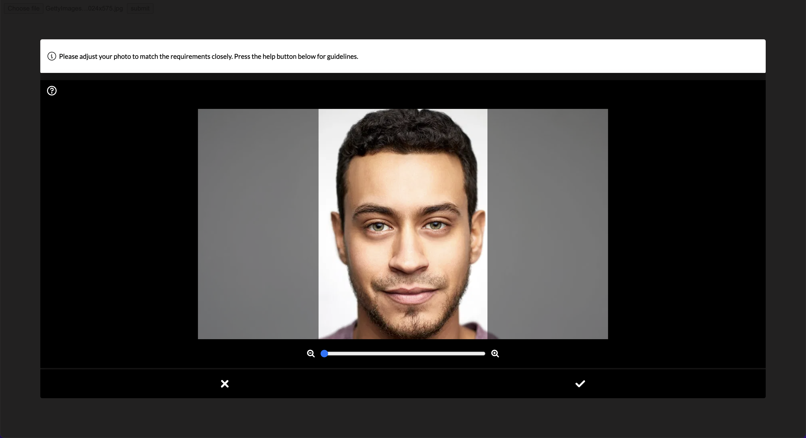

# Photo Validation Modal

The frontend for the photo validation project.



## Usage

```html
<!-- Insert to the HEAD of the page -->

<link
  rel="stylesheet"
  type="text/css"
  href="https://d1mr7f3tqdu5xu.cloudfront.net/assets/photo-validation-modal.css"
/>
<script type="module">
  import { validatePhotoFields } from "https://d1mr7f3tqdu5xu.cloudfront.net/assets/photo-validation-modal.js";

  validatePhotoFields({
    // This is a list of HTMLInputElement file upload field IDs
    // that we want to start providing the validation modal to.
    fieldIds: ["some-field-id"],
  });
</script>
```

## Setup

### Requirements

- node: `^v14.0.0`
- npm: `^8.18.0`

### Development Guide

```sh
npm install
npm run dev
```

This will run a local page running in `http://localhost:5173`, demoing the library.

### Local Photo Validation Service

When running in development and you want to point a local photo validation service (e.g. `http://localhost:3000`):

```sh
touch .env.local
echo "VITE_PHOTO_VALIDATION_BASE_URL=http://localhost:3000" >> .env.local
```

This will override the staging environment.
